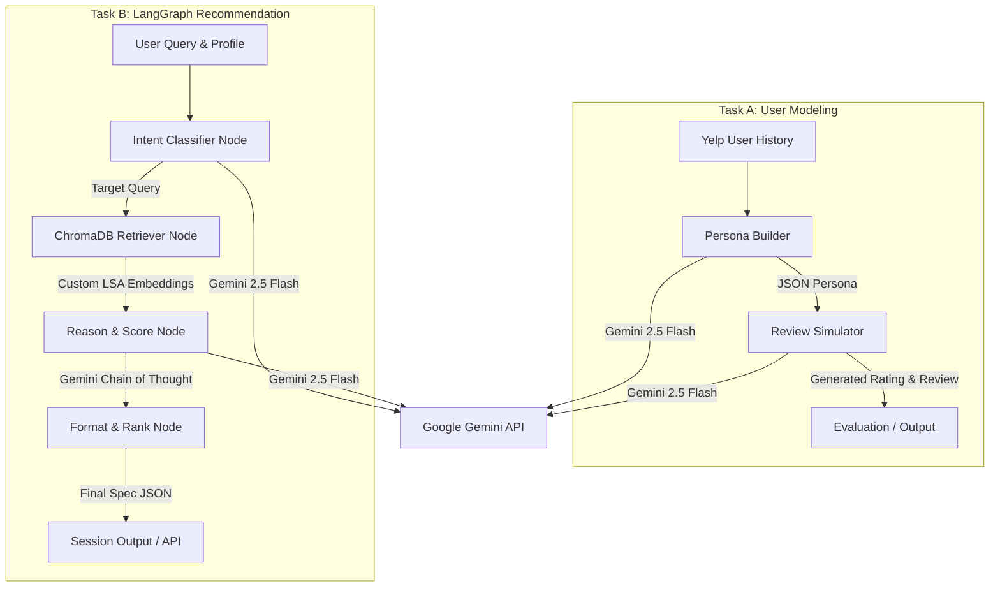

# HeyGent: LLM-Based User Modeling & Recommendation Agents

[](https://www.python.org/)
[](https://fastapi.tiangolo.com/)
[](https://www.docker.com/)
[](https://ai.google.dev/)
[](https://langchain-ai.github.io/langgraph/)

**HeyGent** is a dual-agent system designed for **DSN x BCT Hackathon 3.0**. The system models users as structured behavioural personas to simulate authentic reviews (Task A) and generate highly personalized recommendations through a conversational reasoning graph (Task B).

---

## Key Features

*   **Task A: Behavioral User Modeling & Review Simulation**
    *   **Persona Builder:** Analyzes a user's historical Yelp reviews to extract rating styles, tone, dominant topic priorities, sentiment triggers, and vocabulary signatures.
    *   **Review Generator:** Simulates authentic ratings and written reviews for unseen products/businesses matching the user's voice, length preferences, and calibrated rating tendencies.
*   **Task B: Agentic Recommendation Engine**
    *   **Intent Classifier:** Classifies queries (exploratory, goal-directed, gift-shopping, cold-start) to construct search queries blending explicit contexts and implicit preferences.
    *   **ChromaDB semantic search with custom LSA embeddings:** TF-IDF + Truncated SVD embedding function running in pure Python for high reliability, fast indexing, and zero native PyTorch dependencies.
    *   **LangGraph ReAct Agent:** Coordinates a 4-node pipeline to retrieve, reason (using Chain-of-Thought), score, and rank items.
    *   **Multi-turn conversational refinement:** Exposes session-based routes allowing users to iteratively refine recommendations using natural language feedback.
*   **Nigerian Cultural Context Integration**
    *   Explicit Pidgin English detection and generation (e.g., "dey try", "on point", "no cap").
    *   Local food awareness (Jollof rice, Suya, Pepper soup, Amala, etc.).
    *   Cultural recommendation heuristics prioritizing regional expectations (e.g., constant power availability, reliable AC, value sensitivity).

---

## System Architecture



---

## Repository Structure

```text
├── docs/                      # Submission paper and documentations
│   ├── solution_paper.tex     # Academic-grade LaTeX solution paper (4-8 pages)
│   ├── solution_paper.pdf     # Compiled solution paper PDF
│   └── brief.txt              # Hackathon rules and guidelines
│
├── backend/                   # FastAPI Container Application
│   ├── api/
│   │   └── main.py            # API routing and schema declarations
│   ├── core/
│   │   ├── agent.py           # LangGraph StateGraph & recommendation pipeline
│   │   ├── llm.py             # Lightweight Gemini LangChain emulation wrapper
│   │   ├── persona_builder.py # Behavioral profile extraction
│   │   ├── recommender.py     # Session-based conversational engine
│   │   └── review_generator.py# Voice-matching review simulation
│   ├── data/
│   │   ├── yelp_loader.py     # Yelp JSON dataset parser and mock user profiles
│   │   └── indexer.py         # ChromaDB LSA embedding indexing & semantic retrieval
│   ├── Dockerfile             # Container declaration
│   └── requirements.txt       # Python dependencies
│
├── docker-compose.yml         # Unified container orchestration launcher
└── README.md                  # Beautiful developer landing page
```

---

## Getting Started

### Prerequisites
*   Python 3.9 or higher
*   A Google Gemini API Key (get one for free at Google AI Studio)
*   Docker (Optional, for containerized run)

### Local Environment Setup

1.  **Clone the Repository:**
    ```bash
    git clone https://github.com/ayodejiades/heygent.git
    cd heygent
    ```

2.  **Create a Virtual Environment:**
    ```bash
    python3 -m venv .venv
    source .venv/bin/activate
    ```

3.  **Install Dependencies:**
    ```bash
    pip install -r backend/requirements.txt
    ```

4.  **Set Environment Variables:**
    Create a `.env` file inside `backend/` containing your Google API key:
    ```bash
    GOOGLE_API_KEY=your_gemini_api_key_here
    ```

5.  **Run the API Server:**
    ```bash
    cd backend
    uvicorn api.main:app --host 127.0.0.1 --port 8000 --reload
    ```
    The API docs will be interactive and available at http://127.0.0.1:8000/docs.

---

## Docker Deployment

To build and run the entire application in a container using the root orchestration setup:

```bash
# Start the containerized API on port 8000
docker-compose up --build
```

---

## API Endpoints

### 1. Task A: Generate Simulated Review
*   **Endpoint:** `POST /generate-review`
*   **Request Payload:**
    ```json
    {
      "user_profile": {
        "user_id": "demo_tunde",
        "name": "Tunde",
        "review_count": 3,
        "average_stars": 3.67,
        "avg_review_length_words": 42,
        "rating_distribution": {"2": 1, "4": 1, "5": 1},
        "reviews": [
          {
            "stars": 5,
            "text": "This place is absolutely amazing! The jollof rice reminds me of home. Service was warm.",
            "business_name": "Mama Cass",
            "business_categories": "Nigerian, African"
          }
        ]
      },
      "item": {
        "name": "The Yellow Chilli",
        "categories": "Nigerian, Fine Dining",
        "city": "Lagos",
        "price_range": "$$"
      }
    }
    ```
*   **Response Payload:**
    ```json
    {
      "user_id": "demo_tunde",
      "item": "The Yellow Chilli",
      "stars": 5,
      "review_text": "Omo! The Yellow Chilli is on point! The jollof rice is standard fine dining standard. Service was warm and attentive, definitely coming back!",
      "confidence": 0.95,
      "persona_used": "Tunde appreciates authentic local Jollof rice and warm service."
    }
    ```

### 2. Task B: LangGraph One-Shot Recommendation
*   **Endpoint:** `POST /recommend`
*   **Request Payload:** Pass the `user_profile`, `user_context` (e.g. "looking for a quiet spot with good suya"), and a list of `candidates`.
*   **Response:** Returns a step-by-step reasoning trace and ranked recommendation items containing ratings, personalized justifications (`why_this_user`), and confidence scores.

---

## Compiling the Solution Paper

The Solution Paper is written in high-quality academic LaTeX. To compile it to a PDF:

```bash
cd docs
pdflatex -interaction=nonstopmode solution_paper.tex
# Run it a second time to ensure TikZ page-coordinate references align correctly:
pdflatex -interaction=nonstopmode solution_paper.tex
```
The compiled PDF will be generated at `docs/solution_paper.pdf`.
